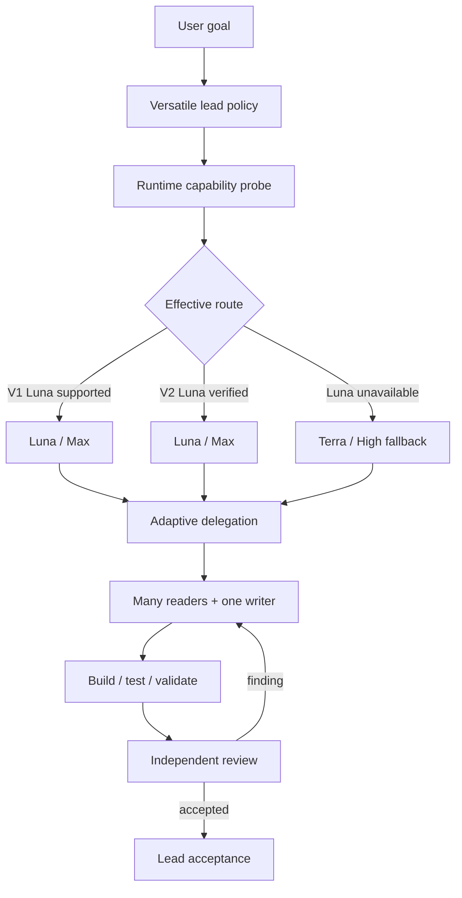

# Versatile Agent development plan

## Goals and acceptance

| Requirement | Implementation | Acceptance evidence |
| --- | --- | --- |
| Project installation | `.agents/skills` + `.codex/agents` | Clean-project install and `--check` |
| User/global installation | `$HOME/.agents/skills` + `$CODEX_HOME/agents` | Isolated user-home install test |
| CLI/App capability check | Runtime probe for both binaries and model catalogs | JSON probe parses and reports V1/V2/Luna/Max |
| Sol/Terra/Luna roles | 12 narrow custom agents and two docs profiles | TOML semantic validator |
| Luna CLI V1 compatibility | `luna-v1` profile pins Luna/Max | Auto-route V1 test |
| Luna fallback | V2 without verified Luna selects Terra/High | Auto-route V2 fallback test |
| Luna Max where used | Luna profile always uses `max` | Profile invariant test |
| One-click artifacts | tarball + self-extracting Bash + SHA-256 | Extract/install/check smoke test |

## Architecture

## Delivery phases

1. **Evidence and compatibility** — restore the prior design, fetch current
   official Codex guidance, and probe CLI/App features and models.
2. **Skill and role design** — define adaptive orchestration policy, bounded
   task contracts, domain review gates, and twelve narrow roles.
3. **Installation** — implement project and user/global scopes, safe config
   merge, backups, manifests, dry-run, and exactness checks.
4. **Fallback routing** — select Luna/Max for verified V1/V2 paths and Terra/High
   when V2 omits Luna or validation fails.
5. **Verification** — validate Skill metadata, TOML, shell/Python syntax,
   installation matrices, idempotency, and preserved config.
6. **Packaging** — build the reviewable tarball, self-extracting Bash installer,
   checksum file, and clean-install smoke test.

## Runtime snapshot used during development

Snapshot date: 2026-08-08.

- CLI: `codex-cli 0.147.0`; `multi_agent=true`;
  `multi_agent_v2=false`.
- App-bundled CLI: `0.147.0-alpha.6.5`; `multi_agent=true`;
  `multi_agent_v2=false`.
- Model catalog: Sol and Terra support through Ultra; Luna supports through
  Max.
- Active native spawn schema: Sol/Terra exposed; Luna not exposed.
- App separate-task schema: Luna/Max exposed, but treated as a user-visible,
  explicit-opt-in route rather than a native subagent fallback.

The installer probes again on the target machine; this snapshot is evidence,
not a hard-coded future assumption.

## Risk controls

- Preserve unrelated `config.toml` content and back up every changed target.
- Do not silently substitute Luna with Terra; persist the selected profile and
  probe evidence.
- Avoid full parent-history copies; prefer a complete five-part task packet.
- Parallelize readers and independent review, not overlapping writers.
- Cap autonomous fix/review loops at three.
- Require benchmark/profiler and numerical/physical evidence for HPC claims.
