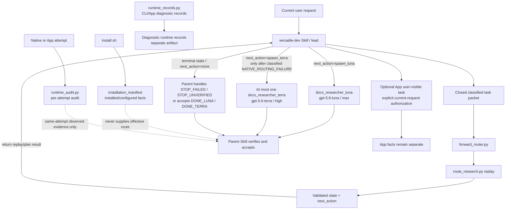

# Versatile Agent implementation and acceptance record

This document records the current shipped implementation and its acceptance
boundaries. The dual-researcher bundle, deterministic helper, and historical
installer migration described below are shipped behavior; the remaining live
boundary is optional schema review rather than a claimed conformance result.

## Implemented bundle

The bundle contains 13 unique common agents under
`payload/agents/common/`:

```text
code_mapper
architect
implementer
tester
test_validator
reviewer
gpu_reviewer
numerics_reviewer
parallelism_reviewer
performance_profiler
security_reviewer
docs_researcher_luna
docs_researcher_terra
```

The two documentation researchers are simultaneous, distinct named profiles:

| File | Requested model/effort | Sandbox |
| --- | --- | --- |
| `payload/agents/common/docs_researcher_luna.toml` | `gpt-5.6-luna` / `max` | `read-only` |
| `payload/agents/common/docs_researcher_terra.toml` | `gpt-5.6-terra` / `high` | `read-only` |

There is no current source profile named `docs_researcher.toml`. The installer
recognizes that path only as a historical compatibility payload: a normal
install backs it up and removes it before installing the two distinct files;
`--check` reports migration pending, `--dry-run` reports the intended migration,
and customized, symlink, or directory conflicts are preserved and fail closed.

## Current architecture and authority boundaries



The parent Skill owns classification, native/App actions, dispatch, diff/test/
review triage, and acceptance. `forward_router.py` and `route_research.py` are
deterministic offline helpers: they consume closed inputs, validate canonical
hashes and state, and return a validated `state`/`next_action` result to the
parent Skill. They never classify prose, dispatch an agent, spawn, probe,
authenticate, access the network, or invent native effective metadata. Only the
parent Skill dispatches `docs_researcher_luna` or the at-most-one
`docs_researcher_terra` handoff.

For a docs packet, the closed forward plan reports
`next_action=precheck`, `permitted_failure_class=NATIVE_ROUTING_FAILURE`,
`max_attempts=1`, and `same_task_packet_hash=true`. These are parent-handling
instructions, not evidence that a native route is effective.

For a documentation task, the same-interface PRECHECK must expose both
researcher names before Luna is requested. Exactly one Terra attempt is allowed
only after a classified native routing rejection or a complete same-attempt
native mismatch, and it must carry the same canonical `task_packet_hash`.
The parent handles the replay states `FALLBACK_PENDING`, `DONE_LUNA`,
`DONE_TERRA`, `STOP_FAILED`, and `STOP_UNVERIFIED`; every terminal state
returns `next_action=none`.
Content, tool, and task failures are terminal `STOP_FAILED`; a timeout with
complete, non-conflicting effective route metadata is terminal
`STOP_FAILED`/`TIMEOUT` with `fallback_attempt=0` and `next_action=none`, and
never authorizes Terra. An explicit same-attempt native routing rejection such
as `requested_model_unavailable` with matching `routing_evidence` is
`NATIVE_ROUTING_FAILURE`, moves Luna to `FALLBACK_PENDING`, and sets
`fallback_attempt=1`/`next_action=spawn_terra`. An `unknown_exception` is
terminal `STOP_UNVERIFIED`/`UNKNOWN_EXCEPTION` with
`fallback_attempt=0`/`next_action=none`, even when route metadata is complete;
missing, conflicting, or unobservable route evidence is also
`STOP_UNVERIFIED`. No other outcome authorizes Terra.

The closed forward plan has three independent App-task outcomes: when no App
task is requested it returns `next_action=none` with reason
`no_app_task_requested`; when an App task is requested and explicitly
authorized in the current request it returns `create_app_task` with reason
`explicit_current_request_authorization`; when an App task is requested
without that authorization it returns `stop_unverified` with reason
`app_task_requires_explicit_current_request_authorization`. The App
user-visible task lane is independent of native subagents and native fallback.
The `gpt-5.6-luna` / `max` App lane used by this P3 development session is not
repository/native effective-route evidence.

## Installation and compatibility record

`install.sh` supports project and user/global scopes. It installs:

- `.agents/skills/versatile-dev` for the Skill;
- `.codex/agents/*.toml` or the corresponding user Codex agents directory for
  all 13 common agents;
- a schema-v2 `.codex/versatile-agent/install-manifest.json` (or the user
  equivalent); and
- an optional idempotent `AGENTS.md` activation snippet.

The accepted selectors are `auto`, `luna-v1`, `luna-v2`, and
`terra-fallback`. `auto` probes the selected CLI and App-bundled CLI and
converts diagnostic output into a compatibility selector. The legacy selector
names remain supported for existing install commands and manifests, but every
successful installation contains both distinct researcher files. The manifest
records `selected_profile`, installed identities, and configured researcher
pins; none of those facts proves the route used by a task.

The installer also preserves unrelated TOML, creates recoverable backups before
replacement, supports `--check` and `--dry-run`, and migrates only recognized
historical researcher payloads. Unknown or conflicting legacy paths are not
overwritten.

## Evidence and artifact separation

The installation manifest is a closed configuration artifact. It records the
bundle version, scope, selected legacy selector, 13 installed identities, and
the configured Luna/Terra researcher tuples. It does not record probe,
capability, observed, effective, or fallback-success facts.

`runtime_records.py` keeps CLI, App-bundled CLI, native-spawn, and App-task
records independent. Probe records are diagnostic-only. `runtime_audit.py`
stores one schema-v1 `runtime_route_audit` per native or independent App-task
attempt. Its closed `attempt` fields are:

```text
attempt_id, task_packet_hash, interface,
requested_agent_type, requested_model, requested_effort,
configured_agent_type, configured_model, configured_effort,
observed_agent_type, observed_effective_model, observed_effective_effort,
requested_sandbox, observed_sandbox, permission_profile,
status, failure_class, fallback_reason, fallback_attempt, evidence_source
```

In particular, the audit has exact `requested_sandbox`, exact
`observed_sandbox`, and one `permission_profile` field; there is no second or
alternate permission-profile field. Its `evidence_source` fields are
`kind`, `interface`, `runtime_id`, `attempt_id`, `scope`, and
`diagnostic_only`. Missing facts remain `unknown`; no artifact may infer
effective native values from an install manifest, probe, TOML, catalog, or
App-task record.

The installation manifest is `artifact_kind=installation_manifest`,
`schema_version=2`, with closed fields `artifact_kind`, `schema_version`,
`bundle_version`, `installed_at`, `scope`, `selected_profile`,
`installed_agents`, and `configured_researchers`. It is separate from the
per-attempt audit and records configuration facts only.

## Acceptance levels

| Level | Commands/evidence | Boundary |
| --- | --- | --- |
| Offline contract/state | `python3 tests/test_runtime_records.py`, `test_routing_state.py`, `test_forward_routing.py`, `test_manifest_audit.py`, `test_skill_contract.py`, `test_agent_contract.py` | Validates closed schemas, route state, helper behavior, and contracts without authentication or network access |
| Offline installer/config | `python3 tests/test_merge_config.py`, `bash tests/test_install.sh`, plus the documentation consistency test | Covers 13-agent installation, dual researcher migration, profiles, backups, idempotency, preserved config, and stale documentation facts |
| Offline bundle validation | `./validate.sh` | Checks shell/Python syntax, payload/Skill/TOML structure, and diagnostic probe structure |
| Offline packaging | `./package.sh` | Runs validation and `tests/run.sh`, then builds and smoke-tests the tarball and self-extracting installer in `dist/` |
| Optional live boundary | `RUN_CODEX_LIVE=1 CODEX_LIVE_EVIDENCE_FILE=... bash tests/test_live_codex.sh` | Schema review only; no authentication or fresh Codex task, and enabled runs always return `UNVERIFIED` |

`tests/run.sh` and `package.sh` deliberately exclude `test_live_codex.sh`.
The optional harness validates supplied evidence without echoing sensitive
values, but it cannot establish live runtime fallback or conformance. A
schema-valid sample is therefore still `UNVERIFIED`.

## Release and packaging behavior

`package.sh` accepts `--output DIR` and `--skip-tests`, runs `validate.sh` and
the offline test gate by default, stages `payload/`, `scripts/`, `tests/`,
`install.sh`, `validate.sh`, `package.sh`, `README.md`,
`DEVELOPMENT_PLAN.md`, and `VERSION`, then produces:

```text
codex-versatile-agent-workflow-<version>.tar.gz
codex-versatile-agent-workflow-offline-installer-<version>.sh
SHA256SUMS
```

It smoke-tests project and user installs with `--check` and does not run the
optional live harness.
